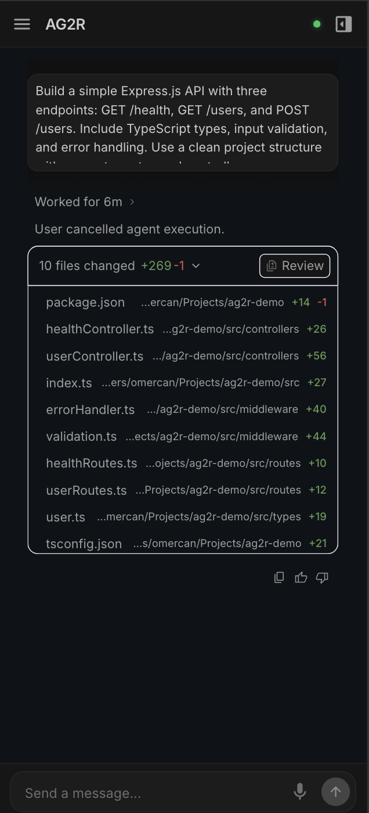
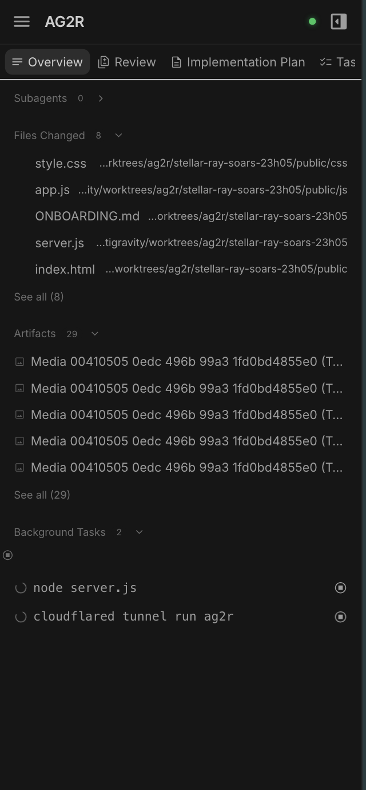
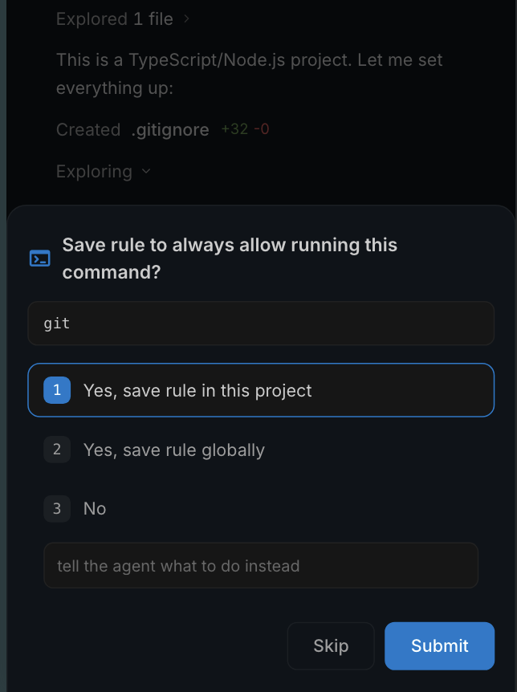
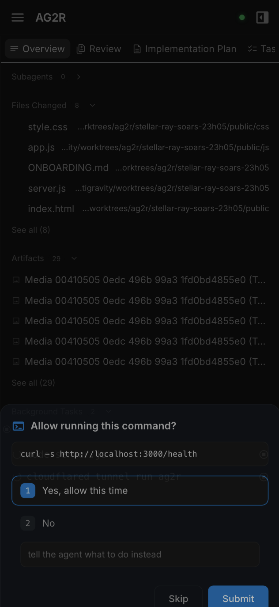
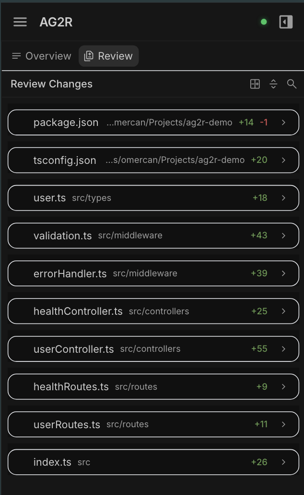
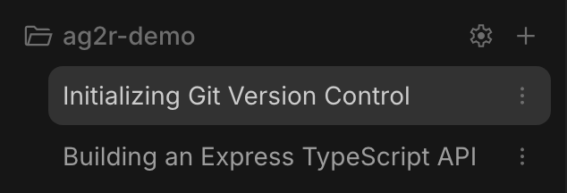
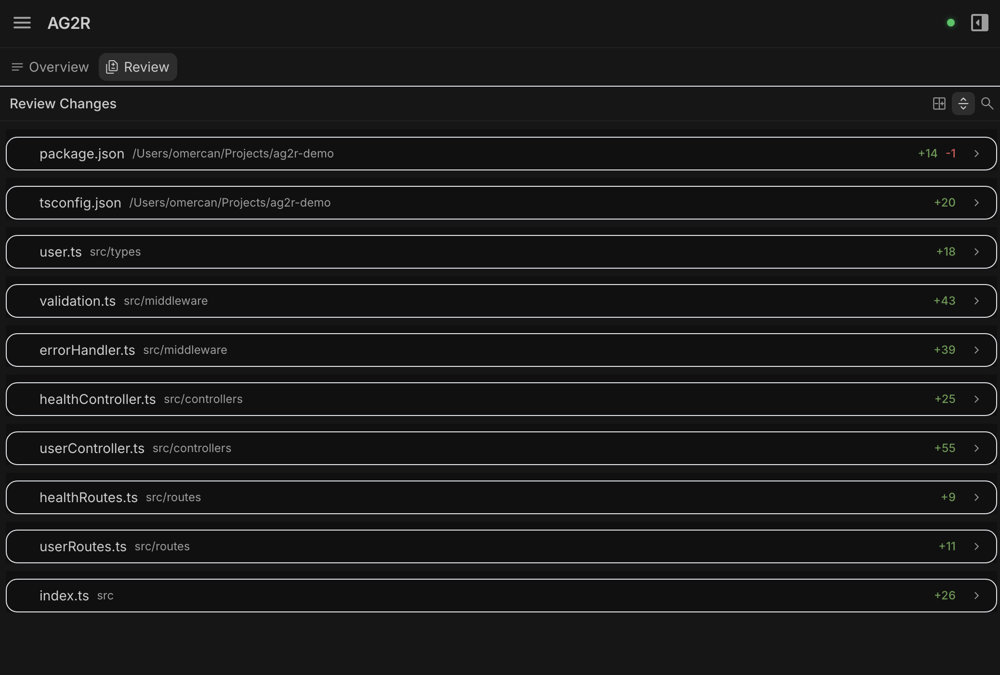
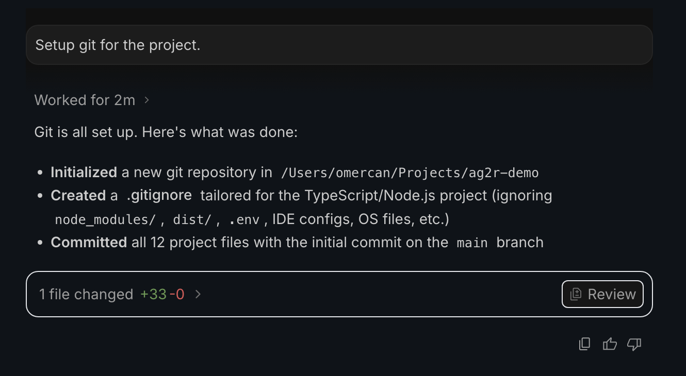
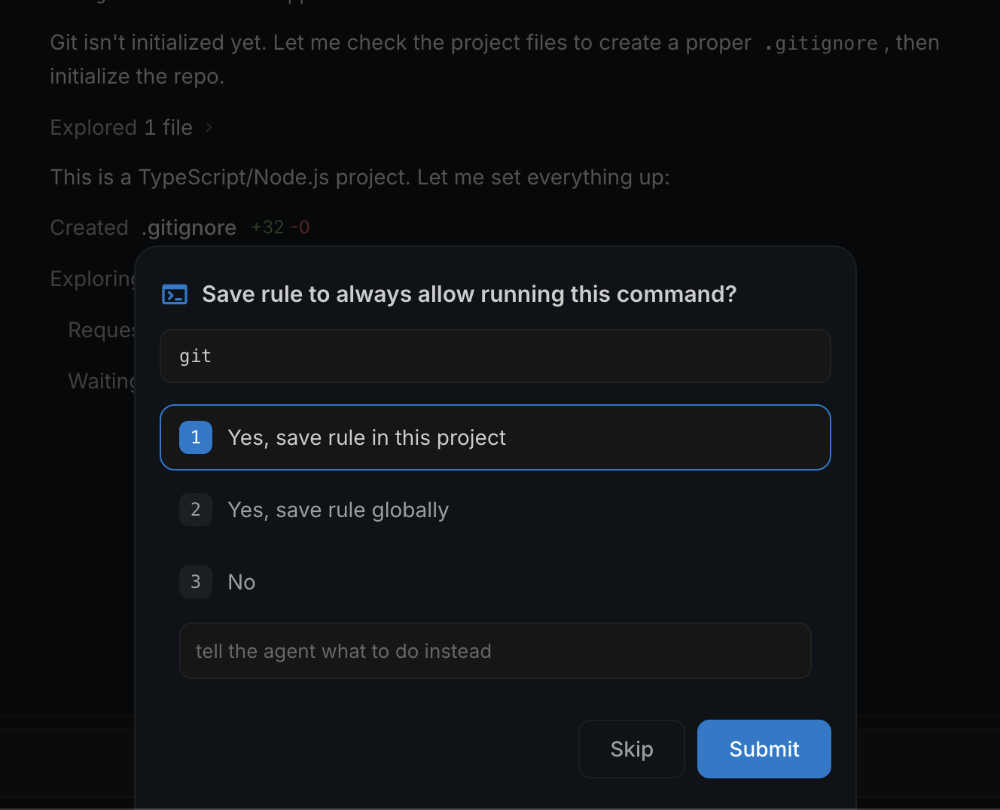

# AG2R — Antigravity 2.0 Remote

A lightweight mobile remote interface for monitoring and interacting with [Antigravity](https://antigravity.dev) AI coding sessions from your phone — on Wi-Fi, hotspot, or anywhere in the world.

<p align="center">
  
  &nbsp;&nbsp;
  
  &nbsp;&nbsp;
  
  &nbsp;&nbsp;
  
</p>

---

## 🚀 Getting Started

### Prerequisites

- Node.js 18+
- Antigravity running with CDP enabled:
  ```bash
  antigravity . --remote-debugging-port=9000
  ```

### Setup

```bash
# Clone the repo
git clone git@github.com:the-future-company/ag2r.git
cd ag2r

# Install dependencies
npm install

# Copy environment config and customize
cp .env.example .env

# Start the server
node server.js
```

On first run, AG2R generates a self-signed SSL certificate in `certs/`.

> [!IMPORTANT]
> **Never commit your `.env` file.** It contains your password and session secret. The `.env.example` file shows the config template — copy it and customize.

---

## 🌐 Three Ways to Connect

### 1. Local Network (Same Wi-Fi)

The simplest setup — works when your phone and computer are on the same Wi-Fi network.

1. Start the server: `node server.js`
2. Open `https://<your-computer-ip>:3000` on your phone
3. Accept the self-signed certificate warning
4. Enter the passcode (default: `antigravity`, configurable in `.env`)

> [!NOTE]
> This does **not** work over mobile hotspot or when you're away from home. Your phone must be on the same network as the computer running AG2R.

---

### 2. Quick Tunnel (Any Network, Temporary URL)

Use [Cloudflare's free quick tunnel](https://developers.cloudflare.com/cloudflare-one/connections/connect-networks/) for instant access from anywhere — no account or domain required. The URL changes each time you restart.

```bash
# Install cloudflared (macOS)
brew install cloudflared

# Start AG2R
node server.js

# In a second terminal, start the tunnel
cloudflared tunnel --url https://localhost:3000 --no-tls-verify
```

Cloudflared prints a random URL like `https://random-words.trycloudflare.com`. Open that on your phone.

> [!WARNING]
> **Set a strong password in `.env` before using any tunnel.** The default password `antigravity` is not secure for internet-facing access.
>
> ```bash
> # In .env
> APP_PASSWORD=your-strong-password-here
> SESSION_SECRET=run-openssl-rand-hex-24-to-generate
> ```

---

### 3. Dedicated Tunnel (Any Network, Stable URL)

Set up a permanent Cloudflare tunnel with your own domain for a stable URL that never changes.

**Prerequisites:**
- A [Cloudflare account](https://dash.cloudflare.com) (free)
- A domain with DNS managed by Cloudflare

**One-time setup:**

```bash
# Install cloudflared
brew install cloudflared

# Login to Cloudflare (select your domain when prompted)
cloudflared tunnel login

# Create a named tunnel
cloudflared tunnel create ag2r

# Route your subdomain to the tunnel
cloudflared tunnel route dns ag2r ag2r.yourdomain.com
```

**Create the config file** at `~/.cloudflared/config.yml`:

```yaml
tunnel: <TUNNEL_ID_FROM_CREATE_STEP>
credentials-file: /path/to/.cloudflared/<TUNNEL_ID>.json

ingress:
  - hostname: ag2r.yourdomain.com
    service: https://localhost:3000
    originRequest:
      noTLSVerify: true
  - service: http_status:404
```

**Set a password** in `.env`:

```bash
APP_PASSWORD=your-strong-password
SESSION_SECRET=run-openssl-rand-hex-24-to-generate
TUNNEL_ENABLED=true
TUNNEL_URL=https://ag2r.yourdomain.com
```

**Run both services:**

```bash
# Terminal 1: AG2R server
node server.js

# Terminal 2: Cloudflare tunnel
cloudflared tunnel run ag2r
```

Open `https://ag2r.yourdomain.com` on your phone — works from anywhere.

> [!TIP]
> To run the tunnel as a background service that starts on boot:
> ```bash
> cloudflared service install
> ```

---

## 📱 Features

### Real-time Chat Monitoring

See Antigravity's responses as they stream in real time. Code blocks, markdown, and all formatting render on your phone exactly as they appear on desktop.

<p align="center">
  
</p>

---

### Permission Handling

Approve, deny, or skip permission requests remotely. Select an option, hit Submit, and the agent continues — no need to walk back to your computer.

<p align="center">
  
  &nbsp;&nbsp;&nbsp;
  
</p>

---

### Code Review

Review file changes directly on your phone. See diffs, browse modified files, and navigate between Overview and Review tabs.

<p align="center">
  
  &nbsp;&nbsp;&nbsp;
  
</p>
---

### Commenting

Select text on any document, leave comments with context, and queue them for batch sending. Comments capture the selected text as a quote and your annotation.

<p align="center">
  
  &nbsp;&nbsp;&nbsp;
  
</p>

---

### Sidebar Navigation & Overview

Switch between conversations, browse files changed, artifacts, and background tasks — all from the sidebar and overview panel.

<p align="center">
  
  &nbsp;&nbsp;&nbsp;
  
</p>

---

### Desktop & Tablet Support

<p align="center">
  
</p>
<p align="center">
  
</p>
<p align="center">
  
</p>
<p align="center">
  <em>Compatible with tablets or desktops as well</em>
</p>

---

### More Features

- **Push notifications** — get notified on your phone when the session needs permission approval, even with the app in the background
- **Send messages** — type and send messages to the AI from your phone
- **Voice input** — dictate messages using your phone's microphone
- **Stop generation** — cancel a running generation with the stop button
- **Auto-reconnect** — seamless reconnection when connection drops
- **Cookie-based auth** — enter passcode once, stays logged in for 30 days

> [!NOTE]
> **iOS users:** Push notifications require the PWA to be installed to your home screen (iOS 16.4+). Open AG2R in Safari, tap the Share button, then "Add to Home Screen".

---

## 🔄 Keep It Running

Use the included watchdog scripts to auto-start AG2R and keep it running. They also auto-update from `origin/main` when new code is merged.

```bash
crontab -e

# Add these lines:
*/5 * * * * ~/Workspace/ag2r/scripts/main-watchdog.sh >> /tmp/ag2r-main-watchdog.log 2>&1
*/5 * * * * ~/Workspace/ag2r/scripts/hub-watchdog.sh >> /tmp/ag2r-hub-watchdog.log 2>&1
*/5 * * * * ~/Workspace/ag2r/scripts/tunnel-watchdog.sh >> /tmp/ag2r-tunnel-watchdog.log 2>&1
```

> [!TIP]
> See [ONBOARDING.md](./ONBOARDING.md) for detailed setup and configuration options.

---

## 🤖 For AI Agents

> Start with **[ONBOARDING.md](./ONBOARDING.md)** for the full technical reference (architecture, file maps, workflows). Your behavioral rules are in **[GEMINI.md](./GEMINI.md)**.

## 📊 Telemetry

AG2R collects anonymous usage metrics (feature counts, crash reports — no personal data) to help improve the project. Set `AG2R_TELEMETRY=false` in your `.env` to disable.

## License

MIT — see [LICENSE](./LICENSE) for details.
